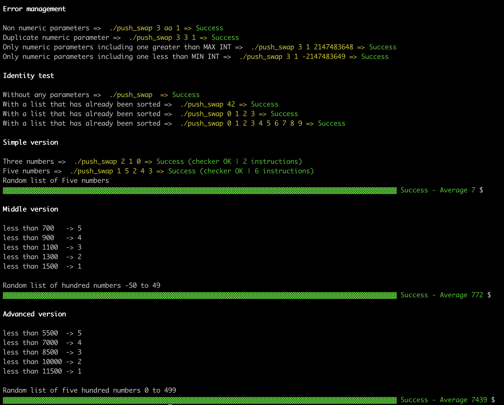

# push_swap_tester
Script to test Push Swap project



### Usage

```bash
git clone git@github.com:laisarena/push_swap_tester.git
cd push_swap_tester
cp ../path_to_push_swap_folder/push_swap .
bash tester.sh
```

You can change the variable 'NUM_TESTS' which determines how many times the program will be run to calculate the averages of operations, using the flag -n <NUMBER>

You can also choose to test only a specific part of the program using the flag -f, as follows:
* -f error : Error management
* -f sorted: Check if sorted lists do nothing
* -f simple: Lists of size 3 and 5
* -f middle: Lists of size 100
* -f advanced: Lists of size 500

### Test Log
You can see the test log into the folder "log_error"
```bash
$ cd log_error
```
And choose the number of numbers tested into the folders "five", "hundred" and "five_hundred"<br>
Then, you can use the command cat to see the content log
```bash
$ ls
five hundred five_hundred
$ cd five
$ ls
test_0 test_5
$ cat test_0
Random list of Five numbers
2 0 1 3 4
sa
pb
pa
sa
Qtt commands = 4
Test Checker = KO
```
